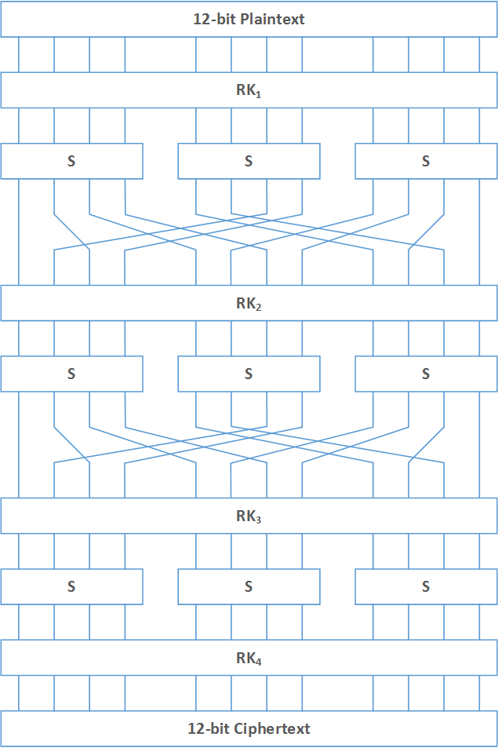

# Toy Cipher를 이용한 차분 분석 예제

## Toy Cipher

예제에서 사용할 Toy Cipher는 참고의 링크에서 설명한 자료를 토대로 만든 것입니다.

이 Toy Cipher는 12비트 블록암호로, 3라운드로 구성되어 있으며, 

12비트씩 4개의 라운드키를 필요로합니다.

라운드키 확장 함수는 따로 없습니다.

ToyCipher의 구조를 그림으로 표현하면 아래와 같습니다.

여기에서 사용한 4-bit S-Box는 다음과 같습니다.

 0 | 1 | 2 | 3 | 4 | 5 | 6 | 7 | 8 | 9 | a | b | c | d | e | f
---|---|---|---|---|---|---|---|---|---|---|---|---|---|---|---
 6 | 7 | b | c | 9 | 8 | 4 | 0 | e | 5 | 3 | d | 1 | 2 | f | a

비트 치환은 다음과 같이 이루어집니다.

 0 | 1 | 2 | 3 | 4 | 5 | 6 | 7 | 8 | 9 | 10 | 11 
---|---|---|---|---|---|---|---|---|---|---|---
 0 | 2 | 4 | 6 | 8 | 10 | 1 | 3 | 5 | 7 | 9 | 11

## 참고

http://www.secmem.org/blog/2019/04/08/차분-공격의-이해/
